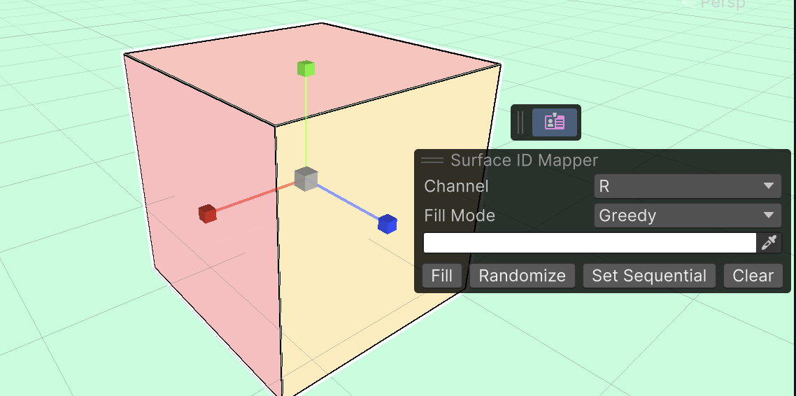
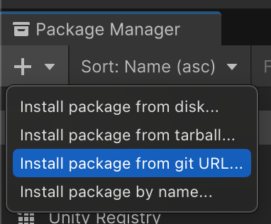
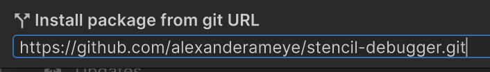

# 🎨 Surface ID Mapper

Surface ID Mapper is a utility for automatically assigning vertex colors to mesh surfaces in Unity.

## Installation

1. Open the package manager and select the `Install package from git URL...` option found under the top left dropdown.

    

2. Enter the following link `https://github.com/alexanderameye/surface-id-mapper.git`.

    

3. Click `Install`.

## Usage

Select a mesh renderer, and click on the button that appears in the scene view to paint it.

**Actions and Shortcuts**
`R` to randomize each surface
`F` to fill each surface with selected color
`Left Click` to paint surface with selected color
`Right Click` to paint surface with random color
`Shift + Left Click` to pick the color of the surface
`Click + Drag` to paint multiple surfaces
`Esc` to leave painting mode

## How does it work?

For each painted gameobject, a `Additional Vertex Stream` component is added which stores the vertex colors. The source mesh is not modified.

## Limitations

- Not tested in production. Use at your own risk.
- The code is messy. Use at your own risk.
- Painting on very large meshes can be slow. Use at your own risk.

## Contact

I am not providing support for this package.

[@ameye.dev](https://bsky.app/profile/ameye.dev) • [https://ameye.dev](https://ameye.dev)

> 💛 Feeling appreciative of this free package? Check out [Linework](https://assetstore.unity.com/packages/slug/294140?aid=1011l3n8v&pubref=surface-id-mapper) 💛
